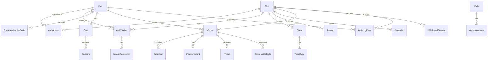

# Modelo ERD

# Objetivo

Este documento define el modelo entidad-relacion inicial para el MVP. El detalle puede evolucionar durante la implementacion con Prisma, pero las relaciones principales deben mantenerse.

## Entidades principales

### User

- id.
- phoneNumber.
- phoneCountryCode.
- phoneVerifiedAt.
- email.
- emailVerifiedAt.
- passwordHash.
- fullName.
- role.
- status.
- createdAt.
- updatedAt.

Reglas:

- `phoneNumber` es obligatorio y sera el identificador principal para registro y login.
- `phoneCountryCode` permite soportar telefonos internacionales desde el inicio.
- `email` es opcional.
- `phoneNumber` debe ser unico normalizado junto con `phoneCountryCode`.
- `email` debe ser unico solo cuando exista.
- `phoneVerifiedAt` indica si el usuario confirmo su telefono.

Relaciones:

- Puede ser administrador de clubes.
- Puede ser trabajador de clubes.
- Puede ser cliente comprador.
- Puede tener wallet.

### PhoneVerificationCode

- id.
- userId.
- phoneCountryCode.
- phoneNumber.
- codeHash.
- purpose.
- expiresAt.
- consumedAt.
- attempts.
- createdAt.

Reglas:

- El codigo se envia al telefono durante el registro.
- El codigo no se almacena en texto plano.
- `purpose` permite diferenciar registro, recuperacion de cuenta u otros flujos futuros.
- Un codigo expirado o consumido no puede usarse.
- Debe limitarse la cantidad de intentos.

### Club

- id.
- name.
- description.
- type.
- coverImageUrl.
- profileImageUrl.
- status.
- address.
- addressJson.
- contactJson.
- socialMediaJson.
- scheduleJson.
- createdAt.
- updatedAt.

Notas:

- `addressJson`, `contactJson`, `socialMediaJson` y `scheduleJson` guardan el perfil estructurado usado por Registrar Negocio y Editar Negocio.
- `scheduleJson` debe almacenar los 7 dias de la semana para que la app mobile pueda reconstruir el formulario.
- El club no usa `slug`, `phone`, `email`, `address` ni `imageUrl` como columnas directas. Si se necesita exponer datos simples en respuestas, se derivan desde el perfil estructurado.

Relaciones:

- Tiene administradores.
- Tiene trabajadores.
- Tiene eventos.
- Tiene productos.
- Tiene promociones.
- Tiene wallet.

### ClubAdmin

- id.
- clubId.
- userId.
- createdAt.

Relaciona administradores con clubes.

### ClubWorker

- id.
- clubId.
- userId.
- status.
- createdAt.
- updatedAt.

Relaciones:

- Tiene permisos.

### WorkerPermission

- id.
- workerId.
- permission.
- createdAt.

### Event

- id.
- clubId.
- name.
- description.
- status.
- startsAt.
- endsAt.
- capacity.
- createdAt.
- updatedAt.

Relaciones:

- Pertenece a un club.
- Tiene tipos de entrada.
- Tiene ordenes asociadas mediante items.
- Tiene tickets.

### TicketType

- id.
- clubId.
- eventId.
- name.
- description.
- price.
- quantity.
- soldQuantity.
- status.
- createdAt.
- updatedAt.

### Product

- id.
- clubId.
- name.
- description.
- price.
- status.
- createdAt.
- updatedAt.

### Promotion

- id.
- clubId.
- name.
- description.
- price.
- status.
- startsAt.
- endsAt.
- createdAt.
- updatedAt.

### Cart

- id.
- userId.
- status.
- createdAt.
- updatedAt.

### CartItem

- id.
- cartId.
- itemType.
- itemId.
- quantity.
- unitPriceSnapshot.
- createdAt.

### Order

- id.
- userId.
- clubId.
- status.
- totalAmount.
- currency.
- createdAt.
- updatedAt.

Nota: si una orden puede contener items de varios clubes en el futuro, se debe separar en subordenes por club. Para el MVP se recomienda limitar checkout a un club por orden.

### OrderItem

- id.
- orderId.
- clubId.
- itemType.
- itemId.
- quantity.
- unitPriceSnapshot.
- totalAmount.
- createdAt.

### PaymentIntent

- id.
- orderId.
- provider.
- providerReference.
- status.
- amount.
- currency.
- createdAt.
- updatedAt.

### Ticket

- id.
- orderId.
- orderItemId.
- clubId.
- eventId.
- ticketTypeId.
- ownerUserId.
- code.
- qrPayloadHash.
- status.
- usedAt.
- createdAt.
- updatedAt.

Regla: un ticket representa una persona.

### ConsumableRight

- id.
- orderId.
- orderItemId.
- clubId.
- eventId.
- ownerUserId.
- sourceType.
- sourceId.
- code.
- qrPayloadHash.
- status.
- usedAt.
- createdAt.
- updatedAt.

Representa productos o promociones compradas y validables.

### Wallet

- id.
- ownerType.
- ownerId.
- currency.
- status.
- createdAt.
- updatedAt.

Owner puede ser cliente, club o plataforma.

### WalletMovement

- id.
- walletId.
- relatedOrderId.
- relatedWithdrawalId.
- type.
- amount.
- currency.
- description.
- createdAt.

Inmutable.

### WithdrawalRequest

- id.
- clubId.
- walletId.
- amount.
- currency.
- status.
- requestedByUserId.
- reviewedByUserId.
- requestedAt.
- reviewedAt.
- paidAt.

### AuditLogEntry

- id.
- actorUserId.
- action.
- resourceType.
- resourceId.
- clubId.
- metadata.
- ipAddress.
- createdAt.

## Diagrama Mermaid inicial

## Decisiones pendientes

- Confirmar si el checkout MVP permite items de varios clubes o solo de un club.
- Definir si productos/promociones pueden estar atados obligatoriamente a eventos.
- Definir politica de devoluciones y cancelaciones.
- Definir modelo exacto de comisiones.
